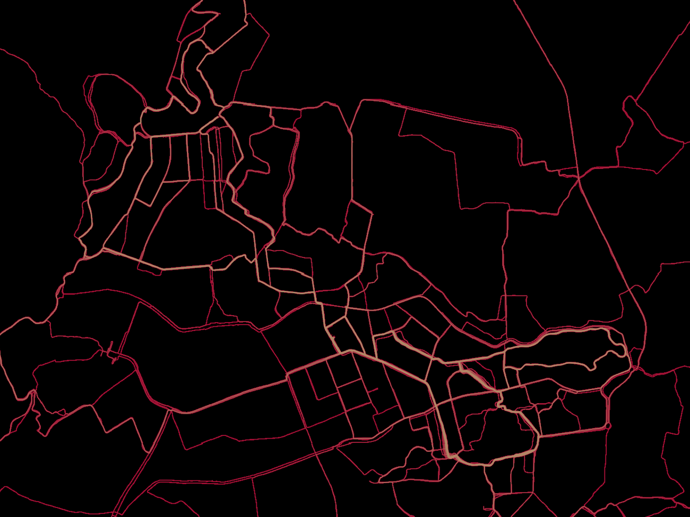

### GPX Heatmap Generator

Generates a heatmap from `.gpx` files. It creates a Tilemap to be overlayed on any other type of map. An example is in the `index.html` file.

#### Usage

Create a `.env`, like the `.env.example` shows
Run `go build .` in the `src/` directory to build the application and run it or  
run `go run .` in the `src/` directory to build and run the application

### Plans

- Add an option to only regenerate tiles with new data, by providing a file that contains the names of new gpx files
- Add an option to add custom start and end colors through envs
- add custom zoomlevels through env