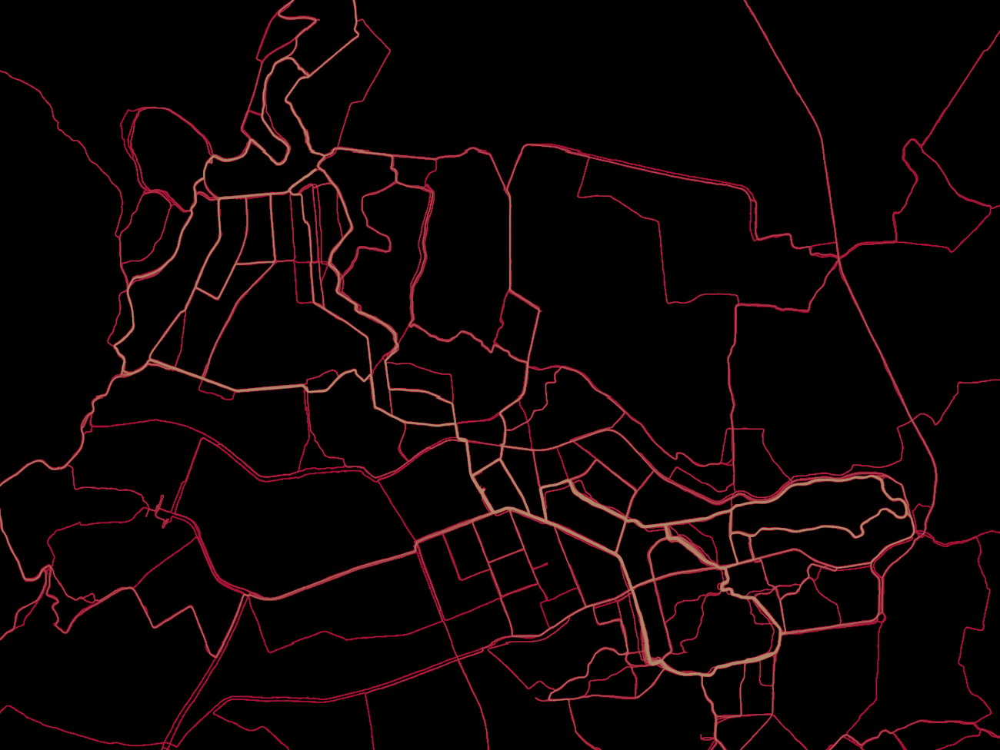

### GPX Heatmap Generator

Generates a heatmap from `.gpx` files. It creates a Tilemap to be overlayed on any other type of map. An example is in the `index.html` file.

#### Example Screenshot

#### Usage

Create a `.env`, like `.env.example` shows  
Run `go build .` in the `src/` directory to build the application and run it **or**  
run `go run .` in the `src/` directory to build and run the application

### Environment variables

#### Necessary Variables
- `GPX_DIRECTORY` Path to the GPX Files (needs to have a trailing /)

#### Optional variables
- `COLOR` colorscheme (red, blue, red-blue, blue-red) leave empty to use default(red), if not provided, the program prompts you to select a color
- `OUTPUT` output directory
- `RECURSIVE` whether to recursively search the input directory
- `IGNORE_DIR` a directory to ignore
- `ONLY_NEW` whether to only generate tiles for new .gpx files, if true, a txt file with file names needs to be provided via `NEW_PATH_GPX` (default is `newgpx.txt`)
- `NEW_GPX_PATH` path to a txt file with the filenames of new gpx files, seperated by newlines

### What's open

- Remove "hardcoded" newgpx.txt for checking what files need to be generated -> move to an interface that can provide these details from a database or local file or whatever
- Add support for using previously calculated bounds for every file to optimise file loading -> probably through the above mentioned interface
- Improve xml parser